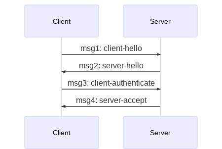

# Secret Handshake for Websockets
---
The primary goal of this project is to create a new implementation of the [Secure Scuttlebutt Secret Handshake](https://ssbc.github.io/scuttlebutt-protocol-guide/#handshake "Secret Handshake - Protocol Guide") in golang over websocket transport.



This project has some other goals:
- favors readability/understandability over cleverness
- favors usability/stability over speed
- work over websockets
- easily change the network key

## Demo
You can run the demo like so:
```bash
$ cd examples/demo
$ ./server.sh &
[1] 24494
Running server...
$ ./client.sh 
Running client...
2020/01/21 00:56:29 Handshake Success: server
2020/01/21 00:56:29 Handshake Success: client
$ fg
./server.sh
$ ^C
```

## Authors Note
This project was started in an effort to learn golang.
The code in this project is heavily influenced by the [secret handshake ssb protocol guide](https://ssbc.github.io/scuttlebutt-protocol-guide/#handshake). I also thought it would be nice to somehow "plug-in" the secret handshake into current or future websocket-based projects. And here it is... I wrote it in such a way to help myself learn some golang, and help myself learn about ssb. Being more of a research project, i would expect bugs and awful code everywhere. Please submit a pull request or an issue if you find anything.


## Inspired By:
- [Golang](https://golang.org/)
- [Websockets](https://github.com/gorilla/websocket)
- [Secure Scuttlebutt](https://scuttlebutt.nz/)
- [Secure Scuttlebutt Protocol Guide](https://ssbc.github.io/scuttlebutt-protocol-guide/)
- [Secret Handshake Paper](https://dominictarr.github.io/secret-handshake-paper/shs.pdf)
- [cryptoscope/ssb](https://github.com/cryptoscope/ssb)
- [agl/ed25519/extra25519](https://github.com/agl/ed25519)
- [Golangs crypto/nacl/box](https://golang.org/x/crypto/nacl/box)

